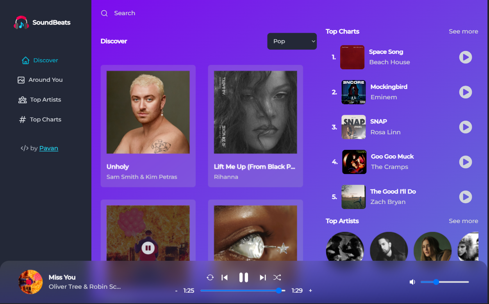
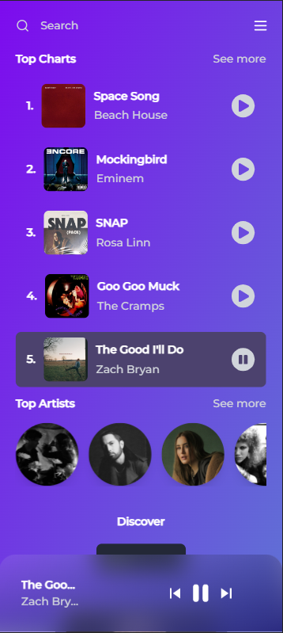

# Project SoundBeats

Develop an elegant React.js Music Application. 

Check out the complete project requirements [here](https://docs.google.com/document/d/13PeFwRlPEhMw_HPyrIrInvQuKaVWnpNmcv-y3NA208s/edit?usp=sharing)

# Preview 





# Contributing

When contributing to this repository, please first discuss the change you wish to make via issue.
Please note we have a [code of conduct](CODE_OF_CONDUCT.md), please follow it in all your interactions with the project.


## System Requirements

To get started with development, you need to install few tools

1. git 
   
   `git` version 2.13.1 or higher. Download [git](https://git-scm.com/downloads) if you don't have it already.

   To check your version of git, run:

   ```shell
    git --version
   ```

2. node 
   
   `node` version 16.15.1 or higher. Download [node](https://nodejs.org/en/download/) if you don't have it already.

   To check your version of node, run:

   ```shell
    node --version
   ```

3. npm
  
   `npm` version 5.6.1 or higher. You will have it after you install node.

   To check your version of npm, run:

   ```shell
    npm --version
   ```

## Setup

To set up a development environment, please follow these steps:

1. Clone the repo

   ```shell
    git clone https://github.com/JavaScript-Mastery-PRO/project1_team4_repository.git
   ```

2. Change directory to the project directory

    ```shell
    cd project1_team4_repository
    ```

3. Install the dependencies
   
    ```shell
     npm install
    ```

    If you get an error, please check the console for more information.

    If you don't get an error, you are ready to start development.

4. Run the app
   
    ```shell
    npm run dev
    ```

    Project will be running in the browser.

    Open [http://localhost:3000](http://localhost:3000) to view it in your browser.

## Issues

You've found a bug in the source code, a mistake in the documentation or maybe you'd like a new feature? You can help us by [submitting an issue on GitHub](https://github.com/pavandeveloperr/SoundBeats/issues). Before you create an issue, make sure to search the issue archive -- your issue may have already been addressed!

Please try to create bug reports that are:

- _Reproducible._ Include steps to reproduce the problem.
- _Specific._ Include as much detail as possible: which version, what environment, etc.
- _Unique._ Do not duplicate existing opened issues.
- _Scoped to a Single Bug._ One bug per report.


## Pull Request

There are 2 main work flows when dealing with pull requests:

* Pull Request from a [forked repository](https://help.github.com/articles/fork-a-repo)
* Pull Request from a branch within a repository

Here we are going to focus on 2. Creating a Topical Branch:


1. First, we will need to create a branch from the latest commit on master. Make sure your repository is up to date first using

   ```bash
    git pull origin main
   ```

   *Note:* `git pull` does a `git fetch` followed by a `git merge` to update the local repo with the remote repo. For a more detailed explanation, see [this stackoverflow post](http://stackoverflow.com/questions/292357/whats-the-difference-between-git-pull-and-git-fetch).

2. To create a branch, use `git checkout -b <new-branch-name> [<base-branch-name>]`, where `base-branch-name` is optional and defaults to `main`. 
   
   Use a standard convention for branch names. For example, `<your-name>-dev`. It will be easier to track your pull requests if you use this convention.
   
   I'm going to create a new branch called `pavan-dev` from the `main` branch and push it to github.

   ```bash
    git checkout -b pavan-dev main
    git push origin pavan-dev
   ```

3. To create a pull request, you must have changes committed to your new branch.

4. Go to [Pull Requests](https://github.com/pavandeveloperr/SoundBeats/pulls) and click on the `New Pull Request` button.

5. Select the `main` branch as the `base` branch and the `jsm-dev` branch as the `compare` branch.

6. Follow the template and fill in the proper information for the pull request.

7. Click on the `Submit` button.

8. You have successfully created a pull request. Now wait for mentor approval. Once approved, you can merge the pull request.

#
